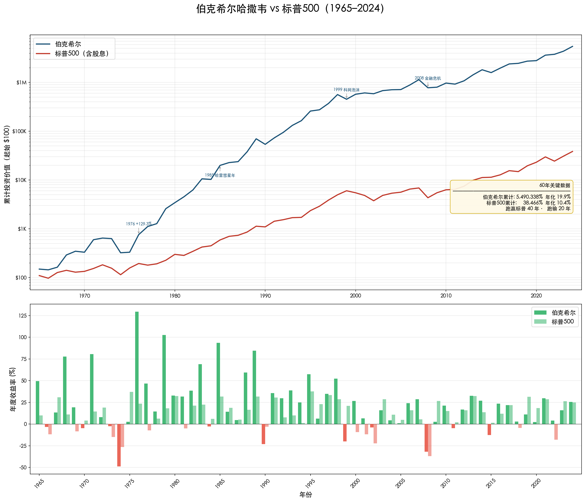

# Buffett Wiki 总索引

## 项目概览

| 类别 | 数量 | 状态 |
|------|------|------|
| 研究笔记 | 5 | ✅ 完整 |
| 经典案例 | 41 | ✅ 完整 |
| 伯克希尔股东信 | 60 | ✅ 完整 (1965-2024) |
| 合伙人信 | 35 | ✅ 完整 (1956-1970，含22封中期信) |
| 访谈与演讲 | 24 | ✅ 完整 (1985-2025) |
| 概念笔记 | 101 | ✅ 完整 |
| 公司笔记 | 54 | ✅ 完整 |
| 人物笔记 | 36 | ✅ 完整 |

## 伯克希尔 60 年业绩总览

> 60 年年化 19.9%，累计收益 5,490,338% · 详见 [伯克希尔哈撒韦业绩表](./wiki/research/伯克希尔哈撒韦业绩表.md)

### 快速导航

- [研究笔记](#研究笔记) - 5 项专题研究
- [经典案例](#经典案例) - 41 个投资案例
- [访谈与演讲](#访谈与演讲-1985-2025) - 24 篇访谈/演讲/股东大会摘要
- [概念索引](#概念索引) - 32 个投资理念核心概念（另有 69 个补充概念）
- [公司索引](#公司索引) - 54 家重要公司
- [人物索引](#人物索引) - 36 位关键人物
- [伯克希尔股东信](#伯克希尔股东信-1965-2024) - 60 封 (1965-2024)
- [合伙人信](#合伙人信-1956-1970) - 35 封 (1956-1970，含中期信)

---

## 研究笔记

> 📊 深度专题研究，基于原始信件的系统性分析

| 研究                                          | 核心发现                                          | 来源范围            |
| ------------------------------------------- | --------------------------------------------- | --------------- |
| [伯克希尔哈撒韦业绩表](./wiki/research/伯克希尔哈撒韦业绩表.md) | 60 年年化 19.9%，累计收益 5,502,284%，领先标普 500 指数 50 年 | 1965-2024 年股东信  |
| [巴菲特合伙基金业绩表](./wiki/research/巴菲特合伙基金业绩表.md) | 13 年年化 29.5%，无亏损年度，领先道指 22%                   | 1957-1969 年合伙人信 |
| [巴菲特市场预测成功率](./wiki/research/市场预测成功率.md)      | 13 次预测中长期命中率 92%，短期 69%                       | 1957-2013 年信件   |
| [巴菲特如何与市场先生相处](./wiki/research/巴菲特如何与市场先生相处.md) | 60 年言行录：5 类市场情景的认知框架与实践结果               | 1964-2024 年股东信 |
| [巴菲特对自己投资决策的反省](./wiki/research/巴菲特对自己投资决策的反省.md) | 1950s-2024s 所有公开承认的投资错误，Errors of Commission/Omission 分类 | 1957-2024 年信件与访谈 |

---

## 经典案例

> 📊 共 **41** 个经典投资案例，按时间顺序排列

### 早期探索（1940s-1950s）

| 案例 | 年份 | 类型 | 核心要点 |
|------|------|------|----------|
| [城市服务](./wiki/research/cases/1941-城市服务-第一只股票.md) | 1940s | 第一只股票 | 114 美元买入，40 美元卖出，5 年后涨至 2000 美元 |
| [克利夫兰精纺厂和加油站](./wiki/research/cases/1951-克利夫兰精纺厂和加油站-早期失败案例.md) | 1950s | 失败案例 | 早期投资失败教训 |
| [洛克伍德公司](./wiki/research/cases/1956-洛克伍德公司-套利交易.md) | 1950s | 套利 | 可可豆套利，净赚 1.3 万美元 |
| [盖可保险](./wiki/research/cases/1951-盖可保险-首次投资.md) | 1951 | 首次投资 | 1 万美元重仓，最终赚回 100 万美元 |
| [桑伯恩地图](./wiki/research/cases/1958-桑伯恩地图-净流动资产价值投资.md) | 1958 | 净流动资产价值 | 地图业务估值从 90 跌至 -20，强制分红 |

### 合伙基金时期（1960s）

| 案例 | 年份 | 类型 | 核心要点 |
|------|------|------|----------|
| [邓普斯特农机](./wiki/research/cases/1961-邓普斯特农机-困境企业turnaround.md) | 1961 | 困境反转 | 控股后更换管理层，资产清理获利 |
| [伯克希尔哈撒韦](./wiki/research/cases/1962-1965-伯克希尔哈撒韦-从投资到控股.md) | 1962-1965 | 从投资到控股 | 7.60-14.86 美元买入，最终控股 |
| [美国运通](./wiki/research/cases/1964-美国运通-色拉油危机.md) | 1964 | 危机投资 | 色拉油丑闻，40% 仓位逆势买入 |
| [迪士尼](./wiki/research/cases/1966-迪士尼-品质投资尝试.md) | 1966 | 品质投资 | 早期品质投资尝试 |
| [霍希尔德 - 科恩](./wiki/research/cases/1966-霍希尔德-科恩-零售业务尝试.md) | 1966 | 零售尝试 | 零售业务尝试 |
| [国民赔偿保险](./wiki/research/cases/1967-国民赔偿保险-保险业务开端.md) | 1967 | 收购 | 保险业务开端，本·罗斯纳加入 |
| [投资人关系](./wiki/research/cases/1967-1969-投资人关系-市场狂热与反思.md) | 1967-1969 | 市场反思 | 市场狂热时期的反思 |
| [联合棉纺](./wiki/research/cases/1968-联合棉纺-廉价收购.md) | 1968 | 廉价收购 | 低价收购案例 |
| [奥马哈太阳报](./wiki/research/cases/1969-奥马哈太阳报-媒体业务.md) | 1969 | 媒体 | 媒体业务投资 |
| [更多保险公司](./wiki/research/cases/1969-更多保险公司-保险业务扩张.md) | 1969 | 保险扩张 | 保险业务持续扩张 |
| [巴菲特合伙公司终结](./wiki/research/cases/1969-巴菲特合伙公司终结-解散.md) | 1969 | 解散 | 主动解散合伙基金 |
| [伊利诺伊国民银行](./wiki/research/cases/1969-伊利诺伊国民银行-银行业务.md) | 1969 | 银行 | 银行业务投资 |

### 伯克希尔时期（1970s）

| 案例 | 年份 | 类型 | 核心要点 |
|------|------|------|----------|
| [蓝筹印花](./wiki/research/cases/1968-蓝筹印花-浮存金模式.md) | 1970s | 浮存金模式 | 浮存金模式建立 |
| [韦斯科金融](./wiki/research/cases/1972-韦斯科金融-芒格的影响.md) | 1972 | 芒格影响 | 查理·芒格的影响 |
| [喜诗糖果](./wiki/research/cases/1972-喜诗糖果-特许经营权.md) | 1972 | 特许经营权 | 品质投资典范，定价权 |
| [华盛顿邮报](./wiki/research/cases/1973-华盛顿邮报-媒体投资.md) | 1973 | 媒体投资 | 1000 万美元投资，持有 40 年 |
| [盖可保险](./wiki/research/cases/1976-盖可保险-危机与复苏.md) | 1976 | 危机与复苏 | 危机中加仓，最终全资收购 |
| [水牛城新闻晚报](./wiki/research/cases/1977-水牛城新闻晚报-媒体投资.md) | 1977 | 媒体投资 | 一城一报经济特许权 |

### 伯克希尔时期（1980s）

| 案例 | 年份 | 类型 | 核心要点 |
|------|------|------|----------|
| [内布拉斯加家具城](./wiki/research/cases/1983-内布拉斯加家具城-家族企业.md) | 1983 | 家族企业 | B 夫人传奇，物美价廉说实话 |
| [大都会/ABC](./wiki/research/cases/1986-大都会-ABC-媒体巨头.md) | 1986 | 媒体巨头 | 投资汤姆·墨菲，最优秀管理层 |
| [斯科特费泽](./wiki/research/cases/1986-斯科特费泽-多元化集团.md) | 1986 | 多元化集团 | 20+ 业务单元，8 倍 PE 收购 |
| [费希海默兄弟](./wiki/research/cases/1986-费希海默兄弟-制造业.md) | 1986 | 制造业 | 利基市场领导者，制服制造 |
| [所罗门兄弟](./wiki/research/cases/1987-所罗门兄弟-投行危机.md) | 1987 | 投行危机 | 7 亿美元可转换优先股，1991 年危机拯救 |
| [可口可乐](./wiki/research/cases/1988-可口可乐-消费巨头.md) | 1988 | 消费巨头 | 无法回避的公司，13 亿美元投资 |
| [波仙珠宝](./wiki/research/cases/1989-波仙珠宝-零售珠宝.md) | 1989 | 零售珠宝 | 1870 年创立，家族经营 4 代 |
| [吉列宝洁](./wiki/research/cases/1989-吉列宝洁-消费品牌.md) | 1989 | 消费品牌 | 剃须刀 + 刀片模式，6 亿美元投资 |
| [USAir](./wiki/research/cases/1989-USAir-优先股投资.md) | 1989 | 优先股失误 | 航空业优先股投资，最终大幅亏损 |

### 伯克希尔时期（1990s）

| 案例 | 年份 | 类型 | 核心要点 |
|------|------|------|----------|
| [富国银行](./wiki/research/cases/1990-富国银行-危机银行投资.md) | 1990 | 危机银行 | 危机中逆势买入，社区银行典范 |
| [美国运通 PERCS](./wiki/research/cases/1991-美国运通-PERCS投资.md) | 1991 | 优先股投资 | PERCS 优先股，转换为普通股 |
| [鞋业集团](./wiki/research/cases/1991-鞋业集团-最残酷的错误.md) | 1991-1993 | 失败案例 | 股权支付遇行业衰退，最残酷的错误 |
| [飞安国际](./wiki/research/cases/1996-飞安国际-资本密集型好生意.md) | 1996 | 资本密集型 | 飞行员培训，资本密集好生意 |
| [威利家具](./wiki/research/cases/1995-威利家具-周日不营业.md) | 1995 | 家族企业 | 周日不营业原则，B 夫人家族传承 |
| [赫兹伯格钻石](./wiki/research/cases/1995-赫兹伯格钻石-人行道交易.md) | 1995 | 人行道交易 | 30 秒决策，珠宝零售连锁 |
| [冰雪皇后](./wiki/research/cases/1997-冰雪皇后-特许经营权.md) | 1997 | 特许经营权 | 冰淇淋快餐连锁，简单业务模式 |
| [利捷航空](./wiki/research/cases/1998-利捷航空-一号担忧.md) | 1998 | 资本密集型 | 分式产权飞机，"一号担忧"的由来 |

---

## 访谈与演讲 (1985-2025)

> 📊 共 **24** 篇访谈/演讲/股东大会摘要，按年份倒序排列
>
> 🔗 [查看完整访谈索引](./wiki/interviews/index.md)

### 股东大会

| 年份 | 标题 | 亮点 |
|------|------|------|
| 2025 | [股东大会](./wiki/interviews/2025-股东大会.md) | 第 60 届，各项记录创新高 |
| 2024 | [股东大会](./wiki/interviews/2024-股东大会.md) | 纪念芒格专场，《穷查理宝典》售出 2400 本 |
| 2023 | [股东大会](./wiki/interviews/2023-股东大会.md) | 芒格最后一次亮相，"咱们也有一位查尔斯国王" |

### 媒体专访与对谈

| 年份 | 标题 | 亮点 |
|------|------|------|
| 2022 | [查理·罗斯对谈](./wiki/interviews/2022-查理罗斯对谈.md) | 91 岁"跳踢踏舞上班"，每周一买 50 亿国库券 |
| 2020 | [CNBC 专访](./wiki/interviews/2020-CNBC专访.md) | 新冠疫情专题，"下跌是好事"，复利的秘密 |
| 2019 | [雅虎财经专访](./wiki/interviews/2019-雅虎财经专访.md) | "苹果就像一座农场"，54 年无经济预测决策 |
| 2017 | [CNBC 采访](./wiki/interviews/2017-CNBC采访.md) | 苹果是消费品公司，利率是估值的"重力" |
| 2017 | [哥伦比亚大学对谈](./wiki/interviews/2017-哥伦比亚大学对谈.md) | 与盖茨联合对谈，"被哈佛拒绝是最美好的事" |
| 2010 | [CNBC 采访](./wiki/interviews/2010-CNBC采访.md) | 餐厅比喻，"经济珍珠港"后复苏 |
| 2010 | [央视财经采访](./wiki/interviews/2010-央视财经采访.md) | "爱等于快乐"，承诺不卖比亚迪 |
| 2007 | [央视专访](./wiki/interviews/2007-央视专访.md) | 中石油清仓理由，中国股市需谨慎 |
| 1998 | [华盛顿大学对话](./wiki/interviews/1998-华盛顿大学对话.md) | 与盖茨经典对谈，400 马力汽车比喻，娘胎彩票 |
| 1985 | [电视采访](./wiki/interviews/1985-电视采访.md) | 首次电视亮相，远离华尔街的理性投资 |

### 大学演讲与 Q&A

| 年份 | 标题 | 亮点 |
|------|------|------|
| 2018 | [北大光华午餐](./wiki/interviews/2018-北大光华午餐.md) | "有大顺风时不要跳舞"，2 分钟判断法 |
| 2017 | [北大对话](./wiki/interviews/2017-北大对话.md) | "最好的投资是投资自己"，花了 20 年走出捡烟蒂 |
| 2016 | [八所大学 MBA 见面会](./wiki/interviews/2016-八所大学MBA见面会.md) | 激情最重要，利率是估值的重力 |
| 2015 | [Ivey 商学院问答](./wiki/interviews/2015-Ivey商学院问答.md) | 波动不是风险，好机会尖叫着要你买入 |
| 2013 | [马里兰大学交流](./wiki/interviews/2013-马里兰大学交流.md) | 护城河需要武士，无条件的爱最强大 |
| 2011 | [南京大学 EMBA 畅谈](./wiki/interviews/2011-南京大学EMBA畅谈.md) | 先估值再看价格，中石油案例详解 |
| 2008 | [Emory 与 Austin 大学问答](./wiki/interviews/2008-Emory与Austin大学问答.md) | 集中投资逻辑，方法公开为何难以模仿 |
| 2005 | [堪萨斯商学院问答](./wiki/interviews/2005-堪萨斯商学院问答.md) | 韩国《穆迪手册》，黄金不会下蛋 |
| 1998 | [佛罗里达大学演讲](./wiki/interviews/1998-佛罗里达大学演讲.md) | 品行决定成败，时间是好生意的朋友 |
| 1991 | [圣母大学演讲](./wiki/interviews/1991-圣母大学演讲.md) | AT&T vs 汤姆森报纸，"花了 25 年才懂得" |
| 1990 | [斯坦福大学演讲](./wiki/interviews/1990-斯坦福大学演讲.md) | 经营与投资的统一，宁可部分拥有伟大公司 |

---

## 合伙人信 (1956-1970)

| 年份 | 摘要 | 分析亮点 |
|------|------|----------|
| [1956 有限合伙协议](./wiki/partnership/1956-有限合伙协议.md) | 合伙企业成立 | 7 位有限合伙人，$105,000 |
| [1957](./wiki/partnership/1957-巴菲特致合伙人信.md) | 投资理念确立 | 两类投资策略，低估类 + 套利类 |
| [1958](./wiki/partnership/1958-巴菲特致合伙人信.md) | 联邦信托案例 | 内在价值$125，买入价$51 |
| [1959](./wiki/partnership/1959-巴菲特致合伙人信.md) | 重仓股占 35% | 投资信托型公司 |
| [1960](./wiki/partnership/1960-巴菲特致合伙人信.md) | 桑伯恩地图案例 | 地图业务估值从$90 跌至-$20 |
| [1961](./wiki/partnership/1961-巴菲特致合伙人信.md) | 三类投资策略 | 低估类 + 套利类 + 控制类 |
| [1962](./wiki/partnership/1962-巴菲特致合伙人信.md) | 登普斯特改造 | 哈里·博特尔上任 |
| [1963](./wiki/partnership/1963-巴菲特致合伙人信.md) | 德州国家石油 | 套利案例详解 |
| [1964](./wiki/partnership/1964-巴菲特致合伙人信.md) | 四类投资 | 新增"相对低估"类别 |
| [1965](./wiki/partnership/1965-巴菲特致合伙人信.md) | 收购伯克希尔 | 买入价$7.60-$14.86 |
| [1966](./wiki/partnership/1966-巴菲特致合伙人信.md) | 十周年 | 领先道指 36 个百分点 |
| [1967](./wiki/partnership/1967-巴菲特致合伙人信.md) | 收购国民赔偿 | 本·罗斯纳、杰克·林沃特加入 |
| [1968](./wiki/partnership/1968-巴菲特致合伙人信.md) | 规模过亿 | 盈利$4000 万 |
| [1969](./wiki/partnership/1969年5月-巴菲特致合伙人信.md) | **宣布退休** | 清算合伙基金 |
| [1970](./wiki/partnership/1970年2月-巴菲特致合伙人信.md) | 债券指南 | 免税债券投资指导 |

**[合伙人信完整索引](./wiki/partnership/index.md)** | 十二年复合收益率 29.6%

> 📌 除年度信外，还有 22 封中期/补充信件（年中、11月、12月），详见[合伙人信完整索引](./wiki/partnership/index.md)

---

## 伯克希尔股东信 (1965-2024)

> 伯克希尔·哈撒韦公司年度股东信，沃伦·巴菲特亲笔撰写

| 年份 | 摘要 | 分析亮点 |
|------|------|----------|
| [1965](./wiki/letters/1965-letter.md) | 接管伯克希尔，净利润同比 +1714% | 回购 12 万股，设备投资 $81 万 |
| [1966](./wiki/letters/1966-letter.md) | 纺织行业承压，首次派息 | 540 万美元投资有价证券 |
| [1967](./wiki/letters/1967-letter.md) | 收购 National Indemnity | 首次进军保险业 |
| [1968](./wiki/letters/1968-letter.md) | 退出梭箱织机坯布业务 | 收购太阳报业，进入出版业 |
| [1969](./wiki/letters/1969-letter.md) | 收购伊利诺伊国民银行 | 净资产 $1700 万、存款 $1 亿 |
| [1970](./wiki/letters/1970-letter.md) | 银行面临新立法 | 本土化保险模式启动 |
| [1971](./wiki/letters/1971-letter.md) | 经营收益超股东权益 14% | 收购家庭汽车保险公司 |
| [1972](./wiki/letters/1972-letter.md) | 经营收益 19.8% 创纪录 | 发行 $2000 万债券 |
| [1973](./wiki/letters/1973-letter.md) | 杰克·林沃特退休 | 与多元零售合并，蓝筹印花重要性提升 |
| [1974](./wiki/letters/1974-letter.md) | 经营收益下滑至 $837 万 | 佛罗里达扩张失败 |
| [1975](./wiki/letters/1975-letter.md) | 十年回顾：$19→$95/股 | 华盛顿邮报投资，收购 K&W |
| [1976](./wiki/letters/1976-letter.md) | 保险强劲反弹 | 首次持有 GEICO |
| [1977](./wiki/letters/1977-letter.md) | 经营收益 $2190 万 | 收购赛普拉斯保险 |
| [1978](./wiki/letters/1978-letter.md) | 与多元零售合并 | 持股提升至 58% |
| [1979](./wiki/letters/1979-letter.md) | 每股账面价值 $335.85 | 深入讨论通胀影响 |
| [1980](./wiki/letters/1980-letter.md) | GEICO 成为最大持仓 | 银行剥离完成 |
| [1981](./wiki/letters/1981-letter.md) | 股东指定捐赠计划 | "蟾蜍与公主"并购论 |
| [1982](./wiki/letters/1982-letter.md) | 期初回报率 9.8% | 讨论保险业同质化困境 |
| [1983](./wiki/letters/1983-letter.md) | 收购内布拉斯加家具店 | B 夫人传奇，经济商誉论述 |
| [1984](./wiki/letters/1984-letter.md) | 每股账面价值 $1108.77 | 讨论损失准备金误差 |
| [1985](./wiki/letters/1985-letter.md) | 净资产增 $613M (+48.2%) | 关闭纺织业务，收购斯科特费泽 |
| [1986](./wiki/letters/1986-letter.md) | 净资产增 $492.5M (+26.1%) | 收购菲希海默，"所有者收益"概念 |
| [1987](./wiki/letters/1987-letter.md) | 净资产增 $464M (+19.5%) | 投资所罗门，市场先生寓言 |
| [1988](./wiki/letters/1988-letter.md) | 净资产增 $569M (+20.0%) | 买入可口可乐、波仙珠宝，套利大捷 |
| [1989](./wiki/letters/1989-letter.md) | 净资产增 $1.515B (+44.4%) | 可口可乐翻倍，吉列/全美航空/冠军国际优先股 |
| [1990](./wiki/letters/1990-letter.md) | 净资产增 $362M (+7.3%) | 买入富国银行，透视收益概念 |
| [1991](./wiki/letters/1991-letter.md) | 净资产增 $2.1B (+39.6%) | 接手所罗门，收购布朗鞋业，买入健力士 |
| [1992](./wiki/letters/1992-letter.md) | 净资产增 $1.52B (+20.3%) | 所罗门落幕，"价值投资是废话"，安全边际论述 |
| [1993](./wiki/letters/1993-letter.md) | 净资产增 $1.5B (+14.3%) | 收购德克斯特鞋业，贝塔值 vs 真实风险，集中投资 |
| [1994](./wiki/letters/1994-letter.md) | 净资产增 $1.45B (+13.9%) | 内在价值定义，斯科特费泽财富 500 强第一，全美航空减记 |
| [1995](./wiki/letters/1995-letter.md) | 净资产增 $5.3B (+45.0%) | 全资收购盖可保险 $23 亿，护城河理论，B 股创设 |
| [1996](./wiki/letters/1996-letter.md) | 净资产增 $6.2B (+36.1%) | 飞安国际收购，B 级股发行，所得税 $8.6 亿 |
| [1997](./wiki/letters/1997-letter.md) | 净资产增 $8.0B (+34.1%) | 泰德·威廉姆斯击球理论，白银投资，所罗门并入旅行家 |
| [1998](./wiki/letters/1998-letter.md) | 账面价值增 $25.9B (+48.3%) | 通用再保险 $220 亿，会计花招批判，"管理沦为操纵" |
| [1999](./wiki/letters/1999-letter.md) | 净资产增 $358M (+0.5%) | 任期最差一年，乔丹家具/中美能源收购，不持有科技股 |
| [2000](./wiki/letters/2000-letter.md) | 净资产增 $3.96B (+6.5%) | 八项收购 ~$80 亿，伊索投资公式，互联网泡沫破裂 |
| [2001](./wiki/letters/2001-letter.md) | 净资产减 $3.77B (-6.2%) | 9·11 恐怖袭击，鲜果布衣破产收购，诺亚法则 |
| [2002](./wiki/letters/2002-letter.md) | 净资产增 $6.1B (+10.0%) | 浮存金成本回归 1%，"衍生品是大规模金融杀伤武器" |
| [2003](./wiki/letters/2003-letter.md) | 净资产增 $13.6B (+21.0%) | 收购克莱顿房屋、麦克莱恩，保险浮存金 $44.2B 零成本 |
| [2004](./wiki/letters/2004-letter.md) | 净资产增 $8.3B (+10.5%) | 四场飓风 $12.5 亿损失，$43B 现金无处投资，贸易逆差 |
| [2005](./wiki/letters/2005-letter.md) | 净资产增 $5.6B (+6.4%) | PacifiCorp $94 亿收购，卡特里娜飓风，继任者计划披露 |
| [2006](./wiki/letters/2006-letter.md) | 净资产增 $16.9B (+18.4%) | 浮存金 $509 亿，利捷航空首年盈利，捐赠计划公布 |
| [2007](./wiki/letters/2007-letter.md) | 净资产增 $12.3B (+11.0%) | 马蒙集团 $45 亿收购，中国石油 $40 亿出售，伟大企业分类法 |
| [2008](./wiki/letters/2008-letter.md) | 净资产减 $11.5B (-9.6%) | 金融危机年，高盛/GE $145 亿投资，康菲石油失误 |
| [2009](./wiki/letters/2009-letter.md) | 净资产增 $21.8B (+19.8%) | BNSF $265 亿收购完成，经济复苏押注 |
| [2010](./wiki/letters/2010-letter.md) | 净资产增 $13.0B (+13.0%) | BNSF 超预期，正常化税前收益 ~$170 亿，Todd Combs 加入 |
| [2011](./wiki/letters/2011-letter.md) | 净资产增 $6.1B (+4.6%) | IBM $109 亿投资，美银 $50 亿优先股，三类资产框架 |
| [2012](./wiki/letters/2012-letter.md) | 净资产增 $24.5B (+14.4%) | 亨氏 ~$120 亿收购，五大引擎超 $100 亿，28 家报纸收购 |
| [2013](./wiki/letters/2013-letter.md) | 净资产增 $34.2B (+18.2%) | 亨氏收购完成，NV Energy 收购，投资哲学寓言 |
| [2014](./wiki/letters/2014-letter.md) | 净资产增 $18.3B (+8.3%) | 50 周年金禧，金霸王收购，Tesco 投资失误 |
| [2015](./wiki/letters/2015-letter.md) | 净资产增 $6.4B (+6.4%) | 精密铸件 $320 亿 + 收购，卡夫亨氏合并，生产力与繁荣论述 |
| [2016](./wiki/letters/2016-letter.md) | 净资产增 $27.5B (+10.7%) | 浮存金 $91.6B，十年赌约第九年，回购政策论述 |
| [2017](./wiki/letters/2017-letter.md) | 净资产增 $65.3B (+23.0%) | 税改收益 $29B，三场飓风 $30B 损失，十年赌约终局，阿吉特/格雷格升任副董事长 |
| [2018](./wiki/letters/2018-letter.md) | GAAP 盈利 $4B (经营收益 $24.8B) | 放弃账面价值指标，"五片树林"框架，苹果成第一大持仓，美国顺风论述 |
| [2019](./wiki/letters/2019-letter.md) | GAAP 盈利 $81.4B (经营收益 $24B) | 留存收益的力量，浮存金 $129.4B，回购 $5B，继任者规划 |
| [2020](./wiki/letters/2020-letter.md) | GAAP 盈利 $42.5B (经营收益 $21.9B) | PCC 减值 $11B 承认错误，回购 $24.7B，BNSF+BHE 合计 $8.3B，"永不做空美国" |
| [2021](./wiki/letters/2021-letter.md) | 经营收益大幅增长 | 现金 $144B，苹果持仓 $161B，BNSF $6B/BHE $4B 双创纪录，两年回购 $51.7B |
| [2022](./wiki/letters/2022-letter.md) | 经营收益 $30.8B 创纪录 | 收购阿勒格尼保险，浮存金 $164B，8 大标普巨头最大股东，查理语录 |
| [2023](./wiki/letters/2023-letter.md) | 经营收益 $37.4B 新纪录 | GAAP 净资产 $561B 全美第一，日本五大商社持股 ~9%，BHE 监管挑战 |
| [2024](./wiki/letters/2024-letter.md) | 经营收益 $47.4B 再创纪录 | 联邦税 $26.8B 破全美纪录，BHE 持股升至 100%，日本投资 $23.5B，格雷格接班在即 |

---

## 概念索引

> 📊 共 **101** 个概念，分为 6 大类别 + 补充概念
> 
> 🔗 [查看完整概念关系图与详细分类](./wiki/concepts/index.md)

### 价值投资核心理念

| 概念 | 英文名 | 说明 | 首次提出 |
|------|--------|------|----------|
| [内在价值](./wiki/concepts/内在价值.md) | Intrinsic Value | 未来现金流折现值 | [1988](./wiki/letters/1988-letter.md) |
| [安全边际](./wiki/concepts/安全边际.md) | Margin of Safety | 价格低于价值的空间 | [1992](./wiki/letters/1992-letter.md) |
| [市场先生](./wiki/concepts/市场先生.md) | Mr. Market | 市场情绪波动 | [1987](./wiki/letters/1987-letter.md) |
| [能力圈](./wiki/concepts/能力圈.md) | Circle of Competence | 知道自己知道什么 | [1996](./wiki/letters/1996-letter.md) |
| [护城河](./wiki/concepts/护城河.md) | Economic Moat | 持续的竞争优势 | [1995](./wiki/letters/1995-letter.md) |

### 投资策略

| 概念 | 英文名 | 说明 | 首次提出 |
|------|--------|------|----------|
| [集中投资](./wiki/concepts/集中投资.md) | Concentrated Investment | 少数高确信度投资 | [1993](./wiki/letters/1993-letter.md) |
| [长期持有](./wiki/concepts/长期持有.md) | Long-term Holding | 买入并持有优质企业 | [1988](./wiki/letters/1988-letter.md) |
| [套利](./wiki/concepts/套利.md) | Arbitrage | 并购事件套利机会 | [1988](./wiki/letters/1988-letter.md) |
| [有效市场](./wiki/concepts/有效市场.md) | Efficient Market | 对有效市场假说的批判 | [1988](./wiki/letters/1988-letter.md) |

### 财务与估值

| 概念 | 英文名 | 说明 | 首次提出 |
|------|--------|------|----------|
| [浮存金](./wiki/concepts/浮存金.md) | Float | 保险沉淀资金 | [1976](./wiki/letters/1976-letter.md) |
| [透视盈余](./wiki/concepts/透视盈余.md) | Look-through Earnings | 持股公司的隐含收益 | [1990](./wiki/letters/1990-letter.md) |
| [所有者收益](./wiki/concepts/所有者收益.md) | Owner Earnings | 真实盈利能力 | [1986](./wiki/letters/1986-letter.md) |
| [经济商誉](./wiki/concepts/经济商誉.md) | Economic Goodwill | 超出账面值的商誉 | [1983](./wiki/letters/1983-letter.md) |
| [账面价值](./wiki/concepts/账面价值.md) | Book Value | 股东权益 | [1965](./wiki/letters/1965-letter.md) |

### 企业经营

| 概念 | 英文名 | 说明 | 首次提出 |
|------|--------|------|----------|
| [管理层](./wiki/concepts/管理层.md) | Management | 诚信能干的管理层 | [1978](./wiki/letters/1978-letter.md) |
| [资本配置](./wiki/concepts/资本配置.md) | Capital Allocation | 资金分配决策 | [1978](./wiki/letters/1978-letter.md) |
| [回购](./wiki/concepts/回购.md) | Share Repurchase | 回购自家股票 | [1965](./wiki/letters/1965-letter.md) |
| [留存收益](./wiki/concepts/留存收益.md) | Retained Earnings | 利润再投资 | [2019](./wiki/letters/2019-letter.md) |
| [复利](./wiki/concepts/复利.md) | Compound Interest | 时间和复利的力量 | [1965](./wiki/letters/1965-letter.md) |
| [股东回报](./wiki/concepts/股东回报.md) | Shareholder Return | 分红与回购 | [1990s](./wiki/letters/1990-letter.md) |

### 风险与行业

| 概念 | 英文名 | 说明 | 首次提出 |
|------|--------|------|----------|
| [保险业](./wiki/concepts/保险业.md) | Insurance | 浮存金来源 | [1967](./wiki/letters/1967-letter.md) |
| [银行业](./wiki/concepts/银行业.md) | Banking | 社区银行投资 | [1990](./wiki/letters/1990-letter.md) |
| [衍生品](./wiki/concepts/衍生品.md) | Derivatives | 金融大规模杀伤武器 | [2002](./wiki/letters/2002-letter.md) |
| [通货膨胀](./wiki/concepts/通货膨胀.md) | Inflation | 对投资的影响 | [1979](./wiki/letters/1979-letter.md) |
| [特许经营权](./wiki/concepts/特许经营权.md) | Franchise | 无形资产优势 | [1992](./wiki/letters/1992-letter.md) |

### 补充概念

> 以下概念页面已创建但未在主分类中列出

| 概念 | 英文名 | 说明 |
|------|--------|------|
| [价值投资](./wiki/concepts/价值投资.md) | Value Investing | 投资哲学核心 |
| [优先股](./wiki/concepts/优先股.md) | Preferred Stock | 可转换优先股投资 |
| [可转换优先股](./wiki/concepts/可转换优先股.md) | Convertible Preferred | 所罗门、GE等 |
| [可转换证券](./wiki/concepts/可转换证券.md) | Convertible Securities | 可转换投资工具 |
| [低估](./wiki/concepts/低估.md) | Undervalued | 格雷厄姆式选股 |
| [净流动资产价值](./wiki/concepts/净流动资产价值.md) | NCAV | 资产底部估值 |
| [买入价格](./wiki/concepts/买入价格.md) | Entry Price | 买入时机与价格 |
| [合理价格](./wiki/concepts/合理价格.md) | Fair Price | 以合理价格买好公司 |
| [优秀企业](./wiki/concepts/优秀企业.md) | Wonderful Company | 伟大企业标准 |
| [品牌](./wiki/concepts/品牌.md) | Brand | 品牌价值与护城河 |
| [商誉](./wiki/concepts/商誉.md) | Goodwill | 会计商誉 vs 经济商誉 |
| [商业模式](./wiki/concepts/商业模式.md) | Business Model | 企业运营模式 |
| [定价权](./wiki/concepts/定价权.md) | Pricing Power | 提价不流失客户 |
| [利基市场](./wiki/concepts/利基市场.md) | Niche Market | 细分市场优势 |
| [竞争优势](./wiki/concepts/竞争优势.md) | Competitive Advantage | 持续竞争优势 |
| [规模效应](./wiki/concepts/规模效应.md) | Scale Advantage | 规模经济 |
| [经济特许权](./wiki/concepts/经济特许权.md) | Economic Franchise | 经济特许权 |
| [企业文化传播](./wiki/concepts/企业文化.md) | Corporate Culture | 企业文化 |
| [不干预管理](./wiki/concepts/不干预管理.md) | Hands-off Management | 信任管理 |
| [管理层评估](./wiki/concepts/管理层评估.md) | Management Assessment | 管理层评估方法 |
| [所有权思维](./wiki/concepts/所有权思维.md) | Owner Mindset | 像所有者一样思考 |
| [诚信](./wiki/concepts/诚信.md) | Integrity | 管理层首要品质 |
| [声誉资产](./wiki/concepts/声誉资产.md) | Reputation | 声誉是最宝贵资产 |
| [股东导向](./wiki/concepts/股东导向.md) | Shareholder Orientation | 以股东利益为先 |
| [公平对待股东](./wiki/concepts/公平对待股东.md) | Fair to Shareholders | 公平对待每位股东 |
| [股东回报](./wiki/concepts/股东回报.md) | Shareholder Return | 分红与回购 |
| [分红](./wiki/concepts/分红.md) | Dividend | 分红政策 |
| [税收效率](./wiki/concepts/税收效率.md) | Tax Efficiency | 税务优化 |
| [承保利润](./wiki/concepts/承保利润.md) | Underwriting Profit | 保险承保盈利 |
| [承保纪律](./wiki/concepts/承保纪律.md) | Underwriting Discipline | 保险承保纪律 |
| [综合比率](./wiki/concepts/综合比率.md) | Combined Ratio | 保险综合成本率 |
| [保险浮存金](./wiki/concepts/保险浮存金.md) | Insurance Float | 保险浮存金详解 |
| [杠杆](./wiki/concepts/杠杆.md) | Leverage | 杠杆的利与弊 |
| [现金流](./wiki/concepts/现金流.md) | Cash Flow | 自由现金流 |
| [现金流折现](./wiki/concepts/现金流折现.md) | DCF | 折现现金流估值 |
| [市盈率](./wiki/concepts/市盈率.md) | P/E Ratio | 市盈率估值 |
| [分散投资](./wiki/concepts/分散投资.md) | Diversification | 分散 vs 集中 |
| [集中持股](./wiki/concepts/集中持股.md) | Concentrated Positions | 重仓持有 |
| [套利交易](./wiki/concepts/套利交易.md) | Risk Arbitrage | 并购套利 |
| [永久持有](./wiki/concepts/永久持有.md) | Permanent Holdings | 永久持有策略 |
| [永久性持股](./wiki/concepts/永久性持股.md) | Permanent Holdings | 四大永久持股 |
| [长期关系](./wiki/concepts/长期关系.md) | Long-term Relationship | 长期合作关系 |
| [逆向投资](./wiki/concepts/逆向投资.md) | Contrarian Investing | 在别人恐惧时贪婪 |
| [在别人恐惧时贪婪](./wiki/concepts/在别人恐惧时贪婪.md) | Be Greedy When Fearful | 经典名言 |
| [机会成本](./wiki/concepts/机会成本.md) | Opportunity Cost | 投资的机会成本 |
| [风险管理](./wiki/concepts/风险管理.md) | Risk Management | 风险管理框架 |
| [风险](./wiki/concepts/风险.md) | Risk | 投资风险 |
| [保守经营](./wiki/concepts/保守经营.md) | Conservative Operation | 保守经营原则 |
| [成本控制](./wiki/concepts/成本控制.md) | Cost Control | 成本意识 |
| [收购](./wiki/concepts/收购.md) | Acquisition | 收购原则与案例 |
| [惯性驱使](./wiki/concepts/惯性驱使.md) | Institutional Imperative | 机构惯性驱使 |
| [传闻研究](./wiki/concepts/传闻研究.md) | Scuttlebutt | 费雪的闲聊法 |
| [行业经验](./wiki/concepts/行业经验.md) | Industry Experience | 行业知识积累 |
| [全球化](./wiki/concepts/全球化.md) | Globalization | 全球投资视野 |
| [美国顺风](./wiki/concepts/美国顺风.md) | American Tailwind | 美国经济顺风 |
| [能源](./wiki/concepts/能源.md) | Energy | 能源行业投资 |
| [公用事业](./wiki/concepts/公用事业.md) | Utilities | 公用事业投资 |
| [公共服务价值](./wiki/concepts/公共服务价值.md) | Public Service Value | 公共服务价值 |
| [航空业](./wiki/concepts/航空业.md) | Airlines | 航空业投资教训 |
| [铁路运输](./wiki/concepts/铁路运输.md) | Railroad | 铁路运输投资 |
| [纺织业务](./wiki/concepts/纺织业务.md) | Textile Business | 伯克希尔纺织业务 |
| [科技与互联网](./wiki/concepts/科技与互联网.md) | Tech & Internet | 科技投资 |
| [媒体与出版](./wiki/concepts/媒体与出版.md) | Media & Publishing | 媒体投资 |
| [零售与消费](./wiki/concepts/零售与消费.md) | Retail & Consumer | 零售消费投资 |
| [家族企业](./wiki/concepts/家族企业.md) | Family Business | 家族企业投资 |
| [债券](./wiki/concepts/债券.md) | Bonds | 固定收益投资 |
| [公司治理](./wiki/concepts/公司治理.md) | Corporate Governance | 公司治理 |
| [市场波动](./wiki/concepts/市场波动.md) | Market Volatility | 市场波动 |
| [市场预测](./wiki/concepts/市场预测.md) | Market Forecast | 市场预测分析 |
| [雪茄烟蒂](./wiki/concepts/雪茄烟蒂.md) | Cigar Butt | 烟蒂投资法 |
| [透视收益](./wiki/concepts/透视收益.md) | Look-through Income | 透视收益(别名) |
| [商誉](./wiki/concepts/商誉.md) | Goodwill | 会计商誉 vs 经济商誉 |

> 🔗 [查看完整概念关系图与分类导航](./wiki/concepts/index.md)

---

## 公司索引

### 保险核心

| 公司 | 英文名 | 投资时间 | 相关概念 |
|------|--------|----------|----------|
| [伯克希尔·哈撒韦](./wiki/companies/伯克希尔·哈撒韦.md) | Berkshire Hathaway | 1965 | 投资旗舰 |
| [GEICO](./wiki/companies/GEICO.md) | GEICO | 1976 | 浮存金典范 |
| [国民保险公司](./wiki/companies/国民保险公司.md) | National Indemnity | 1967 | 再保险 |
| [通用再保险](./wiki/companies/通用再保险.md) | General Re | 1998 | 全球再保险 |
| [阿勒格尼保险](./wiki/companies/阿勒格尼保险.md) | Alleghany | 2022 | 特种保险 |

### 消费品牌

| 公司 | 英文名 | 投资时间 | 相关概念 |
|------|--------|----------|----------|
| [可口可乐](./wiki/companies/可口可乐.md) | Coca-Cola | 1988 | 全球品牌、护城河 |
| [喜诗糖果](./wiki/companies/喜诗糖果.md) | See's Candies | 1972 | 区域定价权 |
| [吉列](./wiki/companies/吉列.md) | Gillette | 1989 | 全球剃须刀霸主 |
| [美国运通](./wiki/companies/美国运通.md) | American Express | 1960s | 信用卡护城河 |
| [宝洁](./wiki/companies/宝洁.md) | P&G | - | 消费品巨头 |
| [卡夫亨氏](./wiki/companies/卡夫亨氏.md) | Kraft Heinz | 2013 | 食品巨头 |

### 金融银行

| 公司 | 英文名 | 投资时间 | 相关概念 |
|------|--------|----------|----------|
| [富国银行](./wiki/companies/富国银行.md) | Wells Fargo | 1990 | 社区银行典范 |
| [美国银行](./wiki/companies/美国银行.md) | Bank of America | 2011 | 优先股投资 |
| [高盛](./wiki/companies/高盛.md) | Goldman Sachs | 2008 | 危机投资 |
| [所罗门兄弟](./wiki/companies/所罗门兄弟.md) | Salomon Brothers | 1987 | 债券交易 |

### 媒体出版

| 公司 | 英文名 | 投资时间 | 相关概念 |
|------|--------|----------|----------|
| [华盛顿邮报](./wiki/companies/华盛顿邮报.md) | Washington Post | 1973 | 媒体投资 |
| [大都会通讯](./wiki/companies/大都会通讯.md) | Capital Cities | 1985 | 广播电视 |
| [布法罗新闻报](./wiki/companies/布法罗新闻报.md) | Buffalo News | 1977 | 报纸出版 |

### 零售批发

| 公司 | 英文名 | 投资时间 | 相关概念 |
|------|--------|----------|----------|
| [内布拉斯加家具店](./wiki/companies/内布拉斯加家具店.md) | Nebraska Furniture Mart | 1983 | 家居零售 |
| [波仙珠宝](./wiki/companies/波仙珠宝.md) | Borsheims | 1988 | 珠宝零售 |
| [沃尔玛](./wiki/companies/沃尔玛.md) | Walmart | - | 零售龙头 |

### 工业制造

| 公司 | 英文名 | 投资时间 | 相关概念 |
|------|--------|----------|----------|
| [伯灵顿北方铁路](./wiki/companies/伯灵顿北方铁路.md) | BNSF | 2009 | 铁路运输 |
| [中美能源](./wiki/companies/中美能源.md) | MidAmerican Energy | 2000 | 公用事业 |
| [精密铸件](./wiki/companies/精密铸件.md) | Precision Castparts | 2015 | 航空制造 |
| [斯科特费泽](./wiki/companies/斯科特费泽.md) | Scott & Fetzer | 1985 | 多元制造 |
| [克莱顿房屋](./wiki/companies/克莱顿房屋.md) | Clayton Homes | 2003 | 预制房屋 |

### 科技能源

| 公司 | 英文名 | 投资时间 | 相关概念 |
|------|--------|----------|----------|
| [苹果](./wiki/companies/苹果.md) | Apple | 2016 | 最大科技持仓 |
| [IBM](./wiki/companies/IBM.md) | IBM | 2011 | 蓝色巨人 |
| [比亚迪](./wiki/companies/比亚迪.md) | BYD | 2008 | 新能源汽车 |
| [国民赔偿保险](./wiki/companies/国民赔偿保险.md) | National Indemnity | 1967 | 保险浮存金 |
| [盖可保险](./wiki/companies/盖可保险.md) | GEICO | 1951 | 汽车保险 |
| [蓝筹印花](./wiki/companies/蓝筹印花.md) | Blue Chip Stamps | 1970 | 浮存金模式 |
| [阿勒格尼保险](./wiki/companies/阿勒格尼保险.md) | Alleghany | 2022 | 特种保险 |
| [内布拉斯加家具城](./wiki/companies/内布拉斯加家具城.md) | NFM | 1983 | 家居零售 |
| [冰雪皇后](./wiki/companies/冰雪皇后.md) | Dairy Queen | 1998 | 快餐连锁 |
| [卡夫亨氏](./wiki/companies/卡夫亨氏.md) | Kraft Heinz | 2015 | 食品巨头 |
| [美国家庭服务](./wiki/companies/美国家庭服务.md) | American Home Products | - | 消费品 |
| [鲜果布衣](./wiki/companies/鲜果布衣.md) | Fruit of the Loom | 2002 | 服装制造 |
| [伊利诺伊国民银行](./wiki/companies/伊利诺伊国民银行.md) | Illinois National Bank | 1969 | 银行业 |
| [房地美](./wiki/companies/房地美.md) | Freddie Mac | 1988 | 抵押贷款 |
| [穆迪](./wiki/companies/穆迪.md) | Moody's | 2000 | 信用评级 |
| [美国合众银行](./wiki/companies/美国合众银行.md) | US Bancorp | 2006 | 社区银行 |
| [伯克希尔·哈撒韦](./wiki/companies/伯克希尔·哈撒韦.md) | Berkshire Hathaway | 1965 | 投资旗舰 |
| [利捷航空](./wiki/companies/利捷航空.md) | NetJets | 1998 | 公务航空 |
| [飞安公司](./wiki/companies/飞安公司.md) | FlightSafety | 1996 | 航空培训 |
| [马蒙集团](./wiki/companies/马蒙集团.md) | Marmon Group | 2007 | 多元工业 |
| [麦克莱恩](./wiki/companies/麦克莱恩.md) | McLane | 2003 | 物流批发 |
| [路博润](./wiki/companies/路博润.md) | Lubrizol | 2011 | 特种化工 |
| [伊斯卡](./wiki/companies/伊斯卡.md) | Iscar | 2006 | 金属切削 |
| [斯科特费泽](./wiki/companies/斯科特费泽.md) | Scott & Fetzer | 1985 | 多元制造 |
| [克莱顿房屋](./wiki/companies/克莱顿房屋.md) | Clayton Homes | 2003 | 预制房屋 |
| [全美航空](./wiki/companies/全美航空.md) | US Airways | 1989 | 航空业 |
| [韦斯科](./wiki/companies/韦斯科.md) | Wesco Financial | 1972 | 芒格影响 |
| [通用电气](./wiki/companies/通用电气.md) | GE | 1987 | 工业集团 |
| [三井物产](./wiki/companies/三井物产.md) | Mitsui | 2020 | 日本商社 |
| [三菱商事](./wiki/companies/三菱商事.md) | Mitsubishi Corp | 2020 | 日本商社 |
| [伊藤忠商事](./wiki/companies/伊藤忠商事.md) | Itochu | 2020 | 日本商社 |
| [西方石油](./wiki/companies/西方石油.md) | Occidental | 2019 | 石油能源 |
| [雪佛龙](./wiki/companies/雪佛龙.md) | Chevron | 2020 | 石油能源 |

---

## 人物索引

> 📊 共 **36** 位关键人物

### 思想导师

| 人物 | 英文名 | 角色 | 相关概念 |
|------|--------|------|----------|
| [本杰明·格雷厄姆](./wiki/people/本杰明·格雷厄姆.md) | Benjamin Graham | 价值投资之父 | 安全边际、内在价值 |
| [费雪](./wiki/people/费雪.md) | Philip Fisher | 成长股投资先驱 | 集中投资 |
| [查理·芒格](./wiki/people/查理·芒格.md) | Charlie Munger | 投资伙伴 | 多元心智模型 |

### 伯克希尔核心高管

| 人物 | 英文名 | 职位 | 分工 |
|------|--------|------|------|
| [阿吉特·杰恩](./wiki/people/阿吉特·杰恩.md) | Ajit Jain | 再保险负责人 | 保险浮存金 |
| [格雷格·阿贝尔](./wiki/people/格雷格·阿贝尔.md) | Greg Abel | 非保险业务负责人 | 能源、零售 |
| [托德·康布斯](./wiki/people/托德·康布斯.md) | Todd Combs | 投资经理 | 股票投资 |
| [特德·韦斯勒](./wiki/people/特德·韦斯勒.md) | Ted Weschler | 投资经理 | 股票投资 |

### 早期管理团队

| 人物 | 英文名 | 职位 | 时期 |
|------|--------|------|------|
| [肯尼思·蔡斯](./wiki/people/肯尼思·蔡斯.md) | Ken Chace | 纺织业务负责人 | 1965-1970 |
| [吉恩·阿贝格](./wiki/people/吉恩·阿贝格.md) | Gene Abegg | 银行行长 | 1931-1978 |
| [B 夫人](./wiki/people/B夫人.md) | Mrs. B | 家具店创始人 | 1983-2000 |
| [B夫人](./wiki/people/B夫人.md) | Mrs. B (alt) | 家具店创始人 | 1983-2000 |
| [查克·哈金斯](./wiki/people/查克·哈金斯.md) | Chuck Huggins | 喜诗糖果 CEO | 1972-2000 |
| [杰克·伯恩](./wiki/people/杰克·伯恩.md) | Jack Byrne | GEICO 救星 | 1970s |
| [杰克·拜恩](./wiki/people/杰克·拜恩.md) | Jack Byrne (alt) | GEICO/消防员基金 | 保险传奇 |
| [杰克·林沃特](./wiki/people/杰克·林沃特.md) | Jack Ringwalt | 国民保险创始人 | 保险业 |
| [肯·蔡斯](./wiki/people/肯·蔡斯.md) | Ken Chace (alt) | 纺织业务负责人 | 早期管理 |
| [斯坦·利普西](./wiki/people/斯坦·利普西.md) | Stan Lipsey | 布法罗新闻报 | 媒体出版 |

### 外部卓越 CEO

| 人物 | 公司 | 角色 | 特点 |
|------|------|------|------|
| [汤姆·墨菲](./wiki/people/汤姆·墨菲.md) | 大都会/ABC | 卓越 CEO | 资本配置典范 |
| [凯瑟琳·格雷厄姆](./wiki/people/凯瑟琳·格雷厄姆.md) | 华盛顿邮报 | 女继承人 | 华盛顿邮报控制人 |
| [李·艾科卡](./wiki/people/李·艾科卡.md) | 克莱斯勒/福特 | 汽车业传奇 | 扭亏为盈 |
| [杰克·韦尔奇](./wiki/people/杰克·韦尔奇.md) | 通用电气 | 前 CEO | 商业精英 |
| [唐·基奥](./wiki/people/唐·基奥.md) | 可口可乐 | 总裁 | 消费品牌 |
| [罗伯托·戈伊苏埃塔](./wiki/people/罗伯托·戈伊苏埃塔.md) | 可口可乐 | CEO | 消费品牌 |
| [彼得·林奇](./wiki/people/彼得·林奇.md) | 麦哲伦基金 | 基金经理 | 成长投资 |
| [托尼·奈斯利](./wiki/people/托尼·奈斯利.md) | GEICO | CEO | 汽车保险 |
| [丹·伯克](./wiki/people/丹·伯克.md) | 大都会/ABC | 联合CEO | 资本配置 |

### 家族与别名

| 人物 | 英文名 | 角色 | 备注 |
|------|--------|------|------|
| [巴菲特](./wiki/people/巴菲特.md) | Warren Buffett | 董事会主席 | 别名页 |
| [沃伦·巴菲特](./wiki/people/沃伦·巴菲特.md) | Warren Buffett | 董事会主席 | 详细页 |
| [霍华德·巴菲特](./wiki/people/霍华德·巴菲特.md) | Howard Buffett | 巴菲特长子 | 董事 |
| [多丽丝·巴菲特](./wiki/people/多丽丝·巴菲特.md) | Doris Buffett | 巴菲特姐姐 | 慈善 |

### 美联储主席

| 人物 | 英文名 | 任期 |
|------|--------|------|
| [艾伦·格林斯潘](./wiki/people/艾伦·格林斯潘.md) | Alan Greenspan | 1987-2006 |
| [本·伯南克](./wiki/people/本·伯南克.md) | Ben Bernanke | 2006-2014 |
| [保罗·沃尔克](./wiki/people/保罗·沃尔克.md) | Paul Volcker | 1979-1987 |
| [尤金·迈耶](./wiki/people/尤金·迈耶.md) | Eugene Meyer | 华盛顿邮报前东主 |
| [约翰·古夫兰](./wiki/people/约翰·古夫兰.md) | John Gutfreund | 所罗门兄弟CEO |
| [鲍勃·德纳姆](./wiki/people/鲍勃·德纳姆.md) | Bob Denham | 所罗门律师 |
| [德里克·莫恩](./wiki/people/德里克·莫恩.md) | Derrick Mormann | 所罗门兄弟 |
